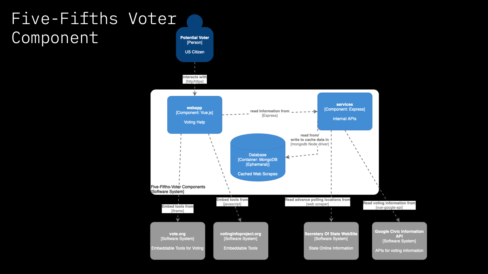

# Five Fifths Voter

# Team

* Alexandria Leggett
* Andrea Lucas 
* Sebastian Hunyh
* David Nixon 
* Yolanda Rabun
* Alexandra Devine
* Syd Bailey
* Gerald Mitchell
* Denise Knorr
* Evelyn R. Anderson
* Chris Stefano
* Dylan Zucker
* Kristen Ray
* Roosevelt Faulkner
* Ricky Ellison
* Ann Umberhocker
* Mike Boone

* Shrey Anand

# Problem and solution

Black voters have experienced obstacles in casting their votes for a long while. The process of casting a vote is challenging due to restrictive local processes, changing requirements, regulations, and lack of information.

The **Five Fifths Voter** solution will help ensure that Black voters can identify the correct polling station, quickly and affordably, according to their own schedule. The project also equips voters with the necessary information to vote according up to date and local requirements.

# Video

# Pitch

The Voting Rights Act of 1965 was enacted to prohibit racial discrimination in voting. Yet, history has shown the inequalities such as voter suppression have led to corruption and a weak democracy that does not reflect the will of the people. The IBM Call for Code for Policy & Legislation Reform has developed a solution to support the voter experience that focuses on addressing key areas of voter suppression such as voter registration, voter ID laws, voter registration restrictions, voter purging, felony disenfranchisement, and gerrymandering, all of which are contributors to disenfranchising minorities and people with disabilities. The *Five Fifths Voter* solution is a cognitive solution designed to determine optimal voting strategies for each individual voter while limiting the impact of previous suppression issues.

# How it works
# Architecture

# Datasets
- [Google Civic Information API](https://developers.google.com/civic-information/)
- [Google Maps API](https://developers.google.com/maps/documentation)
- [Twitter API](https://developer.twitter.com/en/docs/twitter-api)
- [Vote.org Civic engagement tools](https://www.vote.org/technology/)
- [The Voting Information Project](https://www.votinginfoproject.org/)

# Technology
## IBM technology
- [Watson Tone Analyzer](https://www.ibm.com/watson/services/tone-analyzer/)
- [Watson Natural Language Understanding](https://www.ibm.com/cloud/watson-natural-language-understanding)
## Open source technology
- [VueJS](https://vuejs.org)
- [ExpressJS](https://expressjs.com)
- [Python](https://www.python.org)

# For developers

See the [Getting Started](doc/GETSTARTED.md) document.

# Suggestions

See the [issues list](https://github.com/Call-for-Code-for-Racial-Justice/Five-Fifths-Voter/issues) for a full list of issues in the **Five Fifths Voter** project. Issues marked as ["top priority"](https://github.com/Call-for-Code-for-Racial-Justice/Five-Fifths-Voter/issues?q=is%3Aissue+is%3Aopen+label%3A%22top+priority%22) must be considered first.

# Solution fortification

For details, see [Solution Fortification](doc/SolutionFortification.md).
